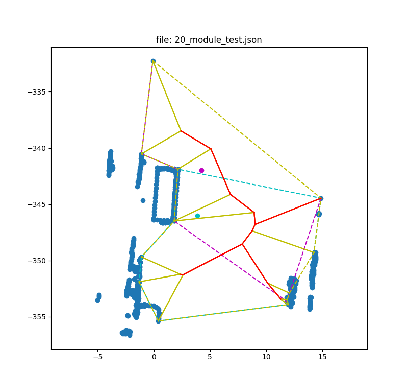
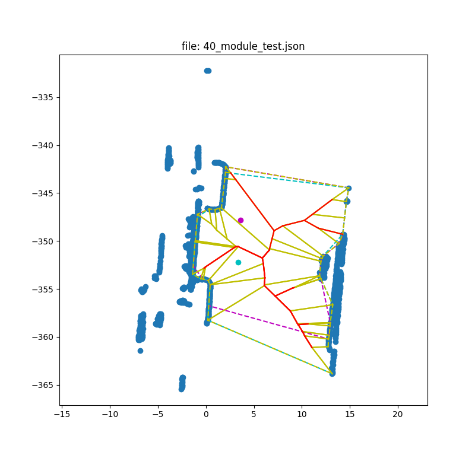
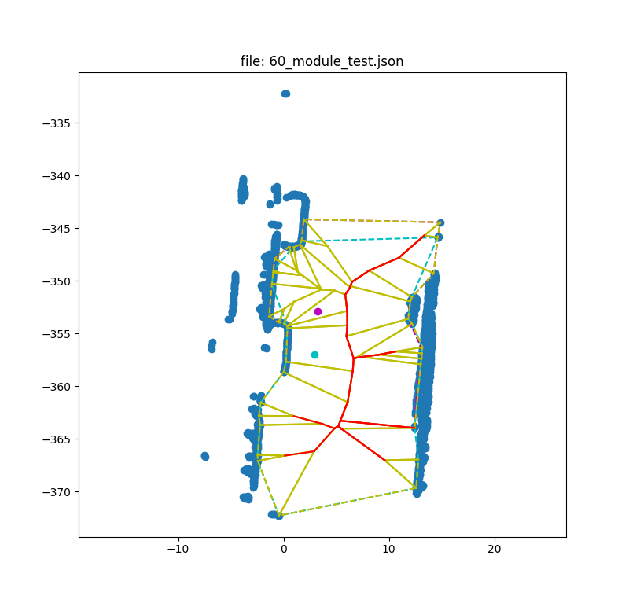
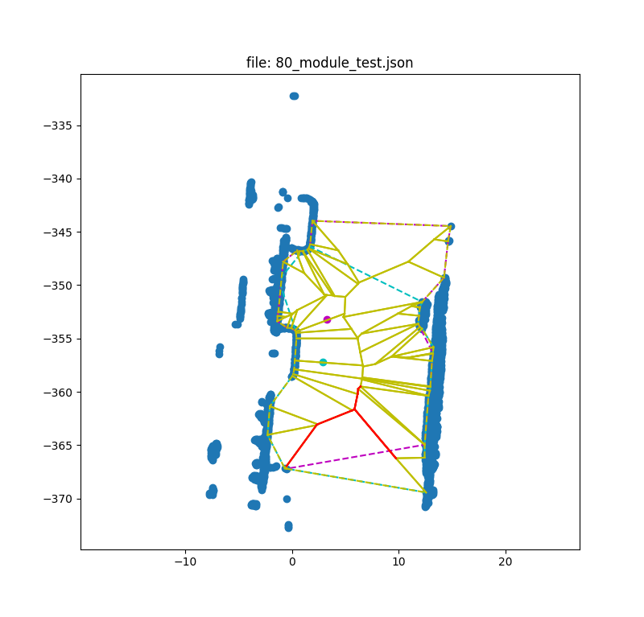
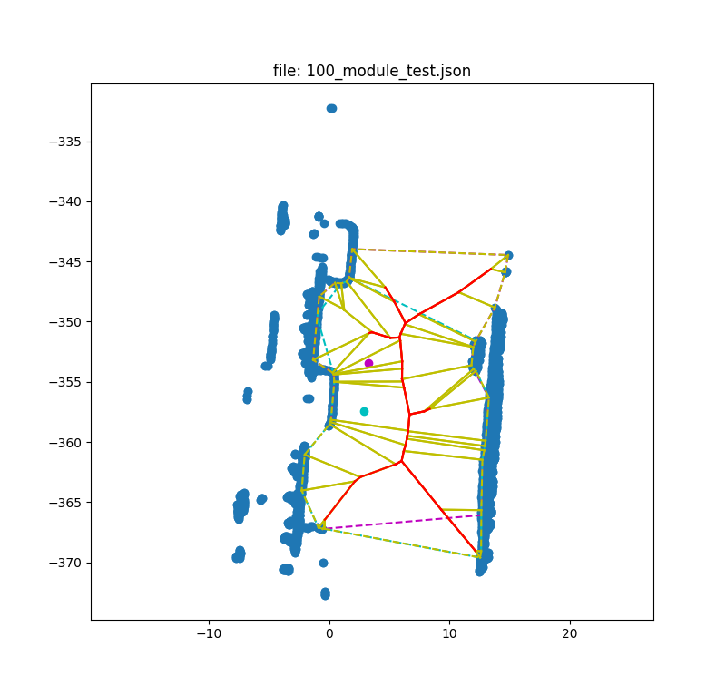

# HierarchicVoronoiSkeleton
implementation of ["Hierarchic Voronoi skeletons"](https://citeseerx.ist.psu.edu/document?repid=rep1&type=pdf&doi=a90e937f5f2b77c90244211f2cd48cb9f5dfe767) in C++.

The algorithm is implemented in C++, and python bindings are available through pybind11.

## Dependencies
- libcgal-dev(>=5.2.4)
- libgmp3-dev
- libboost1.65-dev(or higher)
(Dependencies is complicated, so I decided to use docker to build the project later)

## Build and Run
### build
```bash
mkdir build
cd build
cmake ..
make
```
### run example of hull generation and skeletonization
```bash
python3 example.py ./resources/20_module_test.json
```


or traverse through all folder
```
python3 example.py ./resources/
```






### run example of c++ version
```bash
./example
```